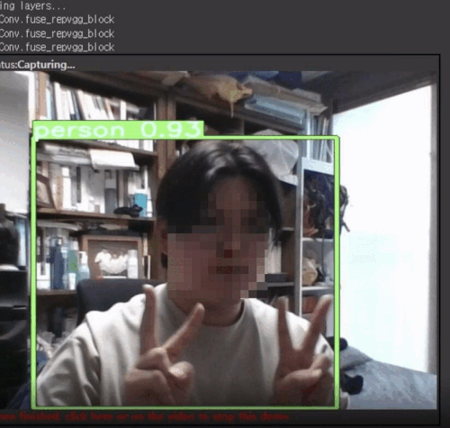

## 온라인 수강생의 자리비움 여부 탐지 모델링

__분석기간 :__ 22.12.22. - 22.01.05. (2주)

__분석인원 :__ 5인

__사용기술 :__ MediaPipe, OpenCV, FaceRecognition, YOLOv3-5-7, streamlit(webrtc,
localtunnel, pyngrok)

__개요 :__

온라인 화상 수업(Zoom)에서 수강생이 자리를 비울 경우를 탐지하는 모델을 구현합니다. 자리에 있는지 여부를 파악하여 메세지를 출력하고, 기록합니다.
- 얼굴 탐지 모델 비교 및 선정(MediaPipe, OpenCV, Face Recognition, YOLOv3-5-7)
- YOLOv7 모델 후처리(사람만 인식하도록, 한 개의 탐지 박스만 출력하도록)
- 탐지된 인물이 탐지되지 않았을 경우, '자리비움' 시간 출력
- Edge Case
  
__담당역할 :__
- colab과 로컬환경에서 웹캠이 구현되는지 테스트를 진행
- MediaPipe, OpenCV, Face Recognition 모델 연구
- 발표
